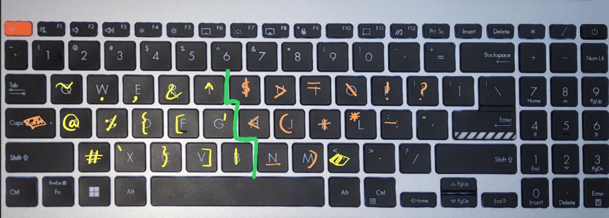

# ⌨️Key remapper for better typing experience
except for pressing ctrl, shift, alt, and win key combos, you don't have to use any key row other than the three main key rows, i.e. the alphabet rows.
This is aimed to reduce the hand movement and improve touch typing experience by placing all the special symbols on the alphabet rows itself.
## 🟩installation (Windows only currently)
1. 💾install AHK form [AutoHotkey](https://www.autohotkey.com/)
 website
2. 📥download all the files and then run them in order > FROM TOP TO BOTTOM
- run by double clicking the files
    1. first > , . caps.ahk
    2. then > num_pad_handling.ahk

now you are good to go!!

## ❓How to Disable
the remappings can easily be toggled on and off from the widows task bar > show hidden icons(near the bottom right corner) > right click the hotkey icons and then disable or exit

- for re-enabling just run the files as mentioned previously

## 🔵Remappings 
`
','  '.'  'capslock'
`
- all the keys except these three will work as usual(even '<'(shift + ,) and '>'(shift + .))
- these three keys are converted to trigger keys and they remap the following keys when they are held down
- for capslock >> press capslock twice whithin 0.2 seconds
- Reason for choosing these keys is that, for pressing ',' and '.' the middle finger and ring finger will be used which are strong, and there is also a factor of convenience for choosing all these triggers and their remmappings.
- I have tried to keep the remappings such that stronger fingers are used for generally more frequently used keys(for the most part) and keep the remappings intuitive.

- remappings for comma & capslock

### Capslock
- y -> $
- u -> >
- i -> =
- o -> \
- p -> !
- [ -> ?

- h -> <
- j -> (
- k -> +
- l -> *
- ; -> -

- n -> _
- m -> )

### ',' key
- q -> ~
- w -> .
- e -> ,
- r -> &
- t -> ^

- a -> @
- s -> %
- d -> {
- f -> [
- g -> '

- z -> #
- x -> `
- c -> }
- v -> ]
- b -> |

### '.' key
- k -> Enter
- j -> Backspace
- i -> shift + enter
- m -> ctrl + bakcspace
- n -> delete

- e -> Up arrow
- d -> Down arrow
- s -> left arrow
- f -> right arrow
- r -> ctrl + right arrow
- w -> ctrl + left arrow

### '.' + ',' (NUM PAD -> experimantal) 
+ `w -> 7    e -> 8    r -> 9`
+ `s -> 4    d -> 5    f -> 6     g -> 0`
+ `x -> 1    c -> 2    v -> 3`

+ `a -> ','`
+ `z -> '.'`

- for using this :-
    - first hold down '.', and while holding it down tap or hold the ','
    - this will change the arrow keys layer of '.' to NUM_PAD
    